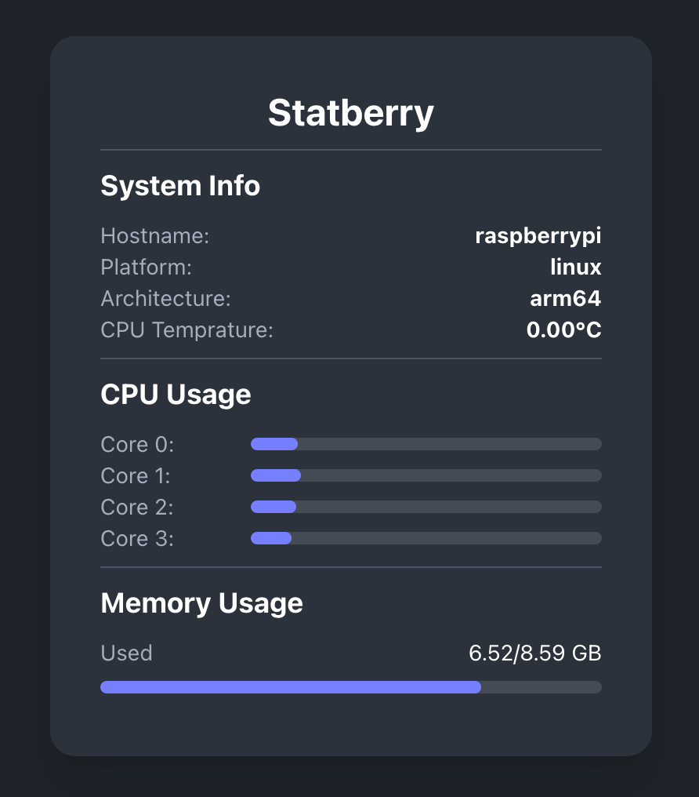

# Statberry - The Raspberry Pi Health Monitor

Statberry is a simple web server written in Golang that displays usage statistics related to the host machine (specifically designed for Raspberry Pi). The server fetches data every 60 seconds but this can be changed in the `hx-trigger` in the `index.templ` file if needed. The UI is built with [HTMX](https://htmx.org/) and [DaisyUI](https://daisyui.com/).



## Requirements

- Go
- Templ
- Tailwindcss

## Installation

1. **Clone the repository**:

   ```sh
   git clone https://github.com/connorrmcd6/statberry.git
   cd statberry
   ```

2. **Build the project**:

   To build the executable file, there are three options listed in the `Makefile`. Use `make build` for Raspberry Pi (64 bit) and `make-build-local` if you would like to build the the binary with your local machines architecture.

   \*note: you may need to update the `getCPUTemperature()` function if you are running on anything but Raspberry Pi as it wont be able to find the `/sys/class/thermal/thermal_zone0/temp` file.

   ```sh
   make build
   ```

3. **Hot Reloading**:

   The repository has been configured for hot reloading with [Air](https://github.com/air-verse/air) if you want to experiment with UI changes.

   Run these commands in separate terminals for hot reloading:

   ```sh
   air
   make templ
   make css
   ```

## Transfer app executable to Raspberry Pi (make sure it is the Linux version)

There are numerous ways to do this, such as:

- `scp` (Secure Copy)
- `rsync`
- `sftp` (Secure File Transfer Protocol)
- Filezilla

## Configuring Webserver with Nginx

Tech With Tim has a great [YouTube video](https://youtu.be/KFwFDZpEzXY?si=w7iPyi5AUkMA4r3u) on this.

Add the following configuration to `/etc/nginx/sites-available/{file_name}` and fill out the relevant values for `file_name` and `pi_public_ip_address`.

```sh
server {
   listen 80;
   listen [::]:80;

   root /var/www/file_name;
   index index.html;
}

server {
   listen 80;
   server_name pi_public_ip;

   location / {
      proxy_pass http://localhost:4000;
      proxy_set_header Host $host;
      proxy_set_header X-Real-IP $remote_addr;
      proxy_set_header X-Forwarded-For $proxy_add_x_forwarded_for;
      proxy_set_header X-Forwarded-Proto $scheme;
   }
}
```

To get the public IP of the Raspberry Pi, type `ifconfig` in the terminal. Use the inet address of the `eth0:` section if using a LAN and use the `wlan0:` section if using Wi-Fi.

### Terminal Screen

I use terminal screens to run my executable.

To start a new screen, run this command:

```sh
screen -S app_name
```

Navigate to the location where the `.exe` is stored and run:

```sh
./app
```

## Contributing

Contributions are welcome! Please feel free to submit a pull request or open an issue if you have any suggestions or improvements. Enjoy using Statberry to monitor your Raspberry Pi's performance! If you have any questions or need further assistance, please feel free to contact me.
